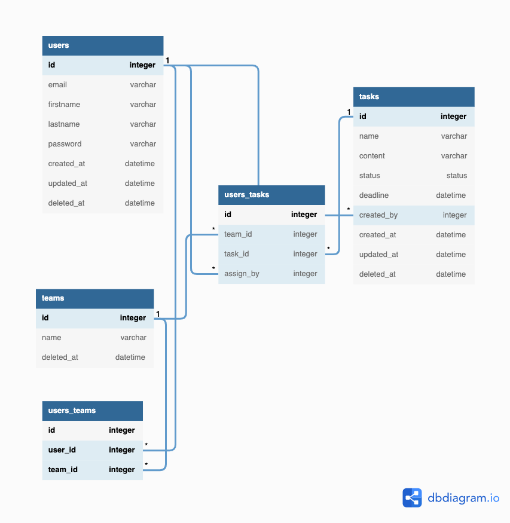

[Insert Your Name Here]

# SGCU65 Backend Recruitment

แบบทดสอบทางวิศวกรรมซอฟต์แวร์ เพื่อสรรหาบุคคลเข้ารับตำแหน่ง Backend Developer ประจำปีการศึกษา 2565

# สารบัญ

- [คำแนะนำ](#คำแนะนำ)
- [โจทย์](#โจทย์)
- [Note](#Note)
- [Tips](#Tips)

# คำแนะนำ

1. แบบทดสอบนี้ถูกออกแบบมาให้ทำเสร็จภายใน **120 ชั่วโมง (5 วัน)** อย่างไรก็ตามคณะกรรมการฯ จะให้เวลาในการทำทั้งหมด **168 ชั่วโมง (7 วัน)** หลังจากที่น้อง ๆ ได้รับบททดสอบนี้แล้ว เนื่องจากผู้สมัครบางท่านอาจจะมีช่วงเวลาที่สะดวกแตกต่างกันไป

2. ให้ผู้สมัครทำการ Fork Repository [isd-sgcu/sgcu65-backend-recruitment](https://github.com/isd-sgcu/sgcu65-backend-recruitment) โดยใช้ Github Account ของผู้สมัครเอง โดยโจทย์แต่ข้อจะอยู่ในโฟลเดอร์ `Problem #<หมายเลขโจทย์>`

3. ในการส่งคำตอบ ให้ผู้สมัครอัพโหลดไฟล์ที่เกี่ยวข้องกับโจทย์ข้อนั้นทั้งหมดขึ้นไปบน Repository ที่ผู้สมัครได้ทำการ Fork ไว้ พร้อมจัดระเบียบไฟล์เหล่านั้นให้เรียบร้อย

4. พึงระลึกไว้เสมอว่าสิ่งเหล่านี้มีความสำคัญในการพัฒนาซอฟต์แวร์จริง ๆ ซึ่งมีผลต่อการพิจารณาผู้สมัคร ดังนี้

   - Code Readability - โค้ดอ่านรู้เรื่อง กระชับ เข้าใจง่าย
   - Commit Message Readability - ข้อความใน commit มีความหมาย

5. กรุณาอ่านรายละเอียดโจทย์และทำความเข้าใจให้เรียบร้อยก่อนทำโจทย์ข้อนั้น ๆ หากมีข้อสงสัยประการใดผู้สมัครสามารถส่งอีเมลไปที่ isd.sgcu64@gmail.com เพื่อสอบถามได้ตลอดเวลา

6. หากมีไอเดียเพิ่มเติมจากที่โจทย์ระบุไว้ ผู้สมัครสามารถระบุไอเดียนั้นลงใปในส่วนของคำตอบ โดยเขียนด้วยรูปแบบดังนั้น

   ```py
   # Addtional Idea: <ไอเดียเพิ่มเติมของผู้สมัคร>
   ```

7. หากมีสมมติฐานเพิ่มเติมที่โจทย์ไม่ได้ให้ข้อมูลไว้ ผู้สมัครสามารถระบุสมมติฐานนั้นลงใปในส่วนของคำตอบ โดยเขียนด้วยรูปแบบดังนั้น

   ```py
   # Assumption: <สมมติฐานของผู้สมัคร>
   ```

8. การตรวจคำตอบจะยึดจาก `commit สุดท้ายใน branch master` ก่อนเวลาสิ้นสุดแบบทดสอบที่ระบุไว้ในอีเมลที่ผู้สมัครได้รับเท่านั้น โปรดพึงระลึกไว้เสมอว่า `การตรงต่อเวลา` เป็นคุณสมบัติที่สำคัญอย่างหนึ่งต่อการเป็นวิศวกรซอฟต์แวร์ที่ดี

9. สามารถค้นหาข้อมูลเพิ่มเติมจากช่องทางใดก็ได้ ในระหว่างการทำแบบทดสอบ

10. การตัดสินของคณะกรรมการฯ ถือเป็นที่สุด

# โจทย์

[//]: # '- [Minimum Requirement](#คำแนะนำ)'
[//]: # '- [Optional Requirement](#รายละเอียดของ Feature (Minimum Requirement))'

## วัตถุประสงค์

- วัดความรู้พื้นฐานในการออกแบบ API Endpoint
- วัดความรู้พื้นฐานในการเลือกใช้ HTTP Methods, Status Codes
- เพื่อทดสอบการวาง project structure
- เพื่อประเมินความสามารถในการแก้ปัญหาของผู้สมัคร

## รายละเอียดโจทย์

บริษัท SGCU ใช้วิธีการเช็คชื่อการเข้างานด้วยการแสกนบัตรพนักงานและจัดการข้อมูลต่างๆของคนในองค์กรด้วยการจดลงสมุดมาโดยตลอด คุณและทีม developer ได้มองเห็นปัญหาของวิธีดังกล่าวจึงต้องการที่จะเปลี่ยนระบบจัดการข้อมูลพนักงานบริษัทไปเป็นแบบ online เพื่อที่จะเปลี่ยนระบบนี้ให้ทันสมัยยิ่งขึ้น สามารถเก็บและแก้ไขข้อมูลได้ง่ายขึ้นคุณจึงยื่นเรื่องให้แก่ท่านประธาน
จากการเสนอข้อมูลให้ประธานบริษัทเขาได้ถูกใจข้อเสนอดังกล่าวเป็นอย่างมาก จึงได้ร้องขอให้คุณและทีม Developer พัฒนาเว็บไซต์ดังกล่าวขึ้นเพื่อมาใช้งานและให้มีระบบการจัดการ task งานต่างๆ (เช่น [tello](https://trello.com) หรือ [jira](https://www.atlassian.com/software/jira)) เพิ่มขึ้นมาด้วย คุณซึ่งเป็นหนึ่งในทีมได้รับหน้าที่ในการวางแผนและออกแบบ API เพื่อที่จะให้เว็บไซต์สามารถทำงานได้อย่างราบรื่น

## งานของคุณ

เขียน API Service ตาม requirement ดังต่อไปนี้

### รายละเอียดของ Feature (Minimum Requirement)

### User

**รายละเอียดการเก็บข้อมูล minimum อยู่ข้างล่าง**

```markdown
- สามารถเพิ่มพนักงานใหม่เข้าไปในระบบได้ (Create)
- สามารถดูข้อมูลของพนักงานทุกคนได้ (Read)
- สามารถแก้ไขข้อมูลของพนักงานได้ เช่นชื่อ-สกุล ตำแหน่ง และเงินเดือนของพนักงานได้ (Update)
- สามารถลบข้อมูลพนักงานในระบบได้ (Delete)
- สามารถค้นหาพนักงานโดยใช้ ชื่อ นามสกุล หรือ ตำแหน่งได้
```

### Task

**รายละเอียดการเก็บข้อมูล minimum อยู่ข้างล่าง**

```markdown
- สามารถสร้าง Task ใหม่ได้ (Create)
- สามารถดูข้อมูลของ Task ทั้งหมดได้ (Read)
- สามารถแก้ไข ข้อมูล/status ของ Task ได้ (Update)
- สามารถลบ Task ได้ (Delete)
- สามารถค้นหา Task ด้วย name หรือ id ได้ (hint: ถ้าใช้ RDBMS สามารถใช้กำหนด relation ของ model ได้)
```

### Other

```markdown
สามารถ assign งานให้ user ได้
โดยที่ user 1 คนสามารถรับได้หลายอันและ task 1 อันสามารถมีผู้รับผิดชอบได้หลายคน
```

### รายละเอียดของ Feature (Optional)

### Team

**รายละเอียดการเก็บข้อมูล minimum อยู่ข้างล่าง**

```markdown
- สามารถสร้าง Team ใหม่ได้ (Create)
- สามารถดูข้อมูลของ Team ทั้งหมดได้ (Read)
- สามารถแก้ไข ข้อมูล ของ Team ได้ (Update)
- สามารถลบ Team ได้ (Delete)
- สามารถค้นหา Team ด้วยชื่อ หรือ id ได้
- สามารถ assign User เข้าทีมได้
- สามารถ assign Task ให้กับ team ได้
  - เปลี่ยนจากการ assign task ให้ user เป็นการ assign task ให้ team แทน
```

### Authentication

```markdown
สามารถเข้าสู่ระบบได้ (โดยใช้ email, รหัสผ่าน)
```

### Authorization

```markdown
สามารถแบ่งแยก user ออกเป็น 2 role คือ User กับ Admin - User - สามารถ login ด้วย username และ password ได้ - สามารถแก้ไข password ของตนเองได้ - สามารถดูข้อมูลของตนเองได้ (นั่นคือ API มีวิธีระบุตัวตนว่าใครเป็นคนยิง API) - **ไม่สามารถ** Create Update Delete Read ได้ - Admin - ทำสิ่งที่ employee ทำได้ - สามารถ สิ่งที่ระบุไว้ 5 ข้อด้านบนได้ (ให้เฉพาะ HR ใช้งานเท่านั้น)
```

## การเก็บข้อมูล (Minimum)

ในส่วนของการเก็บข้อมูลนี้คือ minimum requirement ที่จะต้องเก็บเข้าสู่ระบบถ้ามีเพิ่มเติมมามากกว่านี้สามารถใส่ได้เลย

User

```markdown
- email
- firstname
- surname
- role
```

Task

```markdown
- name
- content
- status
- deadline
```

Team

```markdown
    - name
```

# Note

- ระยะเวลาของการทำ assignment เริ่มนับจากวันที่ผู้สมัครได้รับ email จากทาง อบจ
- ในการทำ assignment นี้ผู้สมัครสามารถเลือกใช้ `framework` `library` `ภาษา` ต่างๆตามที่ถนัดได้เลย (ขอแค่ทำงานตามโจทย์ที่กำหนดให้ได้ก็พอ)
- สิ่งที่ผู้สมัครต้องส่งมา**อย่างน้อย**เพื่อที่จะเข้าสู่รอบสัมภาษณ์คือ **minimum requirement**

## การส่งงาน

1. ให้ผู้สมัครเขียน **ชื่อ-นามสกุล** assignment ไว้ที่ **README.md** ด้วย (แปะไว้ตรงไหนก็ได้ให้รู้ว่าเป็นของใครก็พอ)

2. อัพโหลด source code ทั้งหมดและขอให้เขียนวิธีการ start service มาด้วยในไฟล์ README.md โดยเขียนด้วยรูปแบบดังนี้

   ```
   ## How To Run
   <วิธีการเปิดเว็บ>
   ```

# Tips

- [API คือ?](https://medium.com/skooldio/api-คืออะไร-264ee4186f2c)
- [Framework คือ?](https://medium.com/@FIEHTZ/framework-คืออะไร-f33da15f5fb5)
- [Backend Framework มีอะไรบ้าง?](https://medium.com/javarevisited/10-best-backend-frameworks-for-web-development-8d19e337f774)
- [MVC Concept คือ?](https://medium.com/computer-science-kmitl/การเขียนโปรแกรมแบบ-mvc-คืออะไร-57112d932dde)
- [RDBMS](https://devjourneys.com/2020/04/15/ฐานข้อมูลเบื้องต้น/)
- [SQL & NoSQL](https://medium.com/@todspolwonhchomphu/sql-คืออะไร-และ-nosql-คืออะไร-561c750dbe4d)
- [SQL vs NoSQL](https://phuri.medium.com/nosql-คืออะไร-ต่างจาก-rdbms-หรือ-sql-database-อย่างไร-dd8ac91a4197)

# DB diagram

[](https://dbdiagram.io/d/62b91c9669be0b672c45ea6a)
